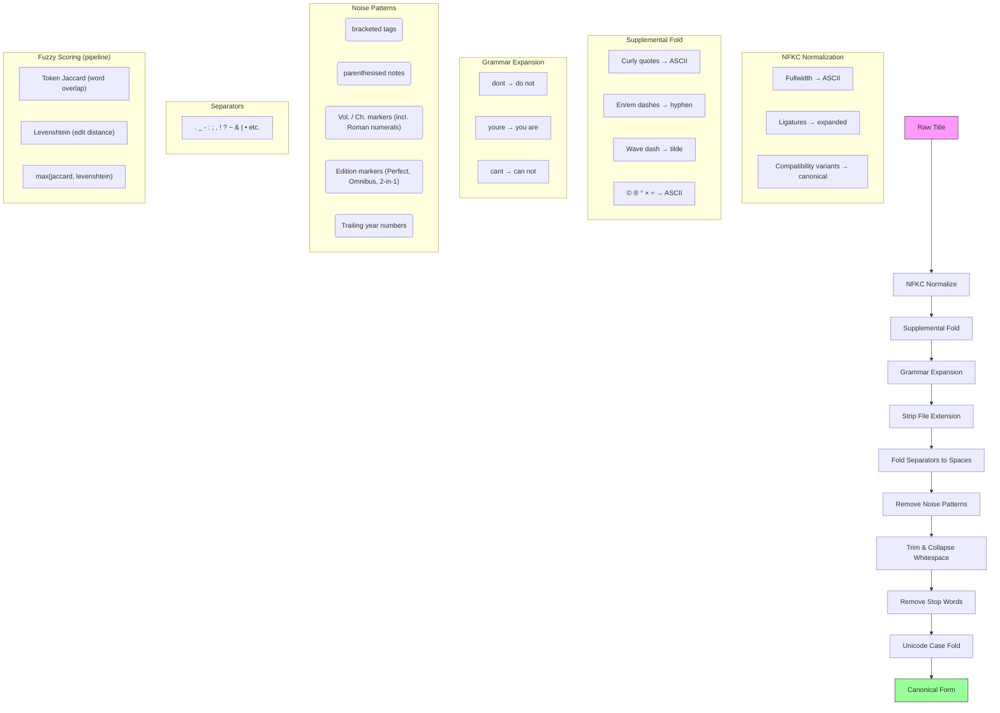

# Name Normalisation

## Overview

Normalisation transforms raw manga/novel titles into deterministic canonical forms so that two titles referring to the same work always produce the same string. This enables reliable lookups and deduplication regardless of how a title is formatted in the wild.

There are two levels of normalisation used in the codebase:

| Level | Purpose | Applied At |
|-------|---------|------------|
| **NFKC normalization** | Unicode normalization form KC — decomposes and recomposes characters to canonical equivalents, maps compatibility characters (fullwidth, ligatures, typographic symbols) to ASCII. Preserves case, words, and non-Latin scripts. | Storage boundaries (insert/update rows) |
| **Full normalisation** | Produce a case-folded, stripped, noise-free canonical form for comparison. | Query time, deduplication, API calls, result matching |

---

## Table of Contents

- [Overview](#overview)
- [When It Is Applied](#when-it-is-applied)
- [Input / Output Examples](#input--output-examples)
- [Technical Implementation](#technical-implementation)
  - [Architecture](#architecture)
  - [Full Normalisation Pipeline](#full-normalisation-pipeline)
  - [NFKC Normalization](#nfkc-normalization)
  - [Alt Titles JSON Functions](#alt-titles-json-functions)
  - [Result Validation](#result-validation)
  - [Configuration](#configuration)
- [Pipeline Diagram](#pipeline-diagram)

---

## When It Is Applied

- **On write** (`Ingest`, `UpsertMedia`): NFKC normalization for stored title. The title_index IS built with full normalisation (including grammar expansion) via `reindexMedia()`, so contraction variants are indexable at write time.
- **On read** (`Lookup`, `FuzzyLookup`, `BatchLookup`): Full normalisation is applied to both the query and every stored title before comparison. Grammar expansion handles contraction variants (case-insensitive, apostrophe-stripping). Fuzzy similarity scoring is used as a fallback when exact match fails.
- **On API calls**: User queries are fully normalised before being sent to MangaDex (including grammar expansion). API results are validated with 4 strategies: substring, space-removed, apostrophe-stripped, and fuzzy similarity.
- **On deduplication** (`batch.go`): Input titles are fully normalised to detect duplicates (grammar expansion ensures "Dont" and "Don't" deduplicate).
- **On maintenance** (`scrape maintenance normalize`): Re-applies NFKC normalization to every row idempotently. Rebuilds the title_index with the updated normalisation.

## Input / Output Examples

| Input | Full Normalised Output |
|-------|----------------------|
| `"Chainsaw.Man"` | `"chainsaw man"` |
| `"[ScanGroup] Bloom Into You (Digital)"` | `"bloom into you"` |
| `"The Manga Name"` | `"manga name"` |
| `"One.Piece.Ch.1090.cbz"` | `"one piece"` |
| `"鬼滅の刃"` | `"鬼滅の刃"` (CJK preserved) |
| `"외모지상주의"` | `"외모지상주의"` (Hangul preserved) |
| `"Hero\u2019s Party"` | `"heros party"` |
| `"Ｍｏｎｓｔｅｒ ＃８"` | `"monster #8"` (fullwidth → ASCII via NFKC) |
| `"straße"` | `"strasse"` (ß → ss via case fold) |
| `"You Like Me, Dont You"` | `"you like me do not you"` (grammar expansion) |
| `"Youre Under My Skin"` | `"you are under my skin"` (grammar expansion) |
| `"Dungeons & Artifacts"` | `"dungeons artifacts"` (ampersand separator) |
| `"Title | Subtitle"` | `"title subtitle"` (pipe separator) |
| `"Baki the Grappler - Perfect Edition"` | `"baki the grappler"` (edition marker stripped) |
| `"Manga Title Vol. III"` | `"manga title"` (Roman numeral vol stripped) |
| `"Some Manga 2022"` | `"some manga"` (trailing year stripped) |
| `"Ascendance of a Bookworm - Part 01"` | `"ascendance of a bookworm part 01"` (part number preserved) |

## Technical Implementation

### Architecture

The normaliser is implemented in `internal/normalize/normalize.go`. It depends on `golang.org/x/text/unicode/norm` for NFKC normalization and `golang.org/x/text/cases` for Unicode case folding. All regexes are compiled once in `New()`. The normaliser is immutable after construction — safe for concurrent use by multiple goroutines.

### Full Normalisation Pipeline

The `Normalize()` method applies these steps in order:

1. **NFKC normalize + supplemental fold** -- Unicode NFKC via `golang.org/x/text/unicode/norm`, then a supplemental fold map for ~25 characters NFKC misses (curly quotes, en/em dashes, wave dashes, typographic symbols).
2. **Grammar expansion** -- Expand common English contractions and misspellings using the extensible `GrammarRules` map (e.g., `dont` → `do not`, `youre` → `you are`). Applied after fold, before separator folding. Ensures contracted and expanded forms normalise identically.
3. **Extension strip** -- Remove common media file extensions (`.cbz`, `.mkv`, `.epub`, etc.) using a pre-compiled regex.
4. **Separator fold** -- Replace punctuation separators (`.`, `_`, `-`, `:`, `;`, `,`, `!`, `?`, `'`, `"`, `~`, `&`, `|`, `•`, and their fullwidth variants) with spaces via a dynamically built character-class regex.
5. **Noise removal** -- Strip bracketed tags `[...]`, parenthesised notes `(...)`, volume/chapter markers (e.g. `Vol. 3`, `Ch 1090`, `Vol. III`), edition markers (`Perfect Edition`, `Omnibus Edition`, `2-in-1 Edition`), and trailing year numbers (e.g. `2022`) using regex patterns.
6. **Multi-space collapse** -- Repeatedly collapse double spaces into single spaces.
7. **Stop word removal** -- Filter out common words (`the`, `a`, `an`, `and`, `of` by default) from the word list.
8. **Unicode case fold** -- Case-insensitive folding via `golang.org/x/text/cases`. Replaces `strings.ToLower` to handle locale-aware case mappings (`ß → ss`, Kelvin `K → k`, etc.).

### NFKC Normalization

NFKC (Unicode Normalization Form KC) is the foundation of the fold step. It is the recommended normalization form for this codebase because:

- **Standards-compliant**: Covers all compatibility equivalents in Unicode (thousands of characters vs ~90 hand-picked entries).
- **Hangul-safe**: Unlike NFKD, NFKC does not decompose Hangul syllables into Jamo.
- **Idempotent by definition**: Applying NFKC multiple times produces the same result.
- **Handles cases the manual table missed**: Ligatures (`fi` → `fi`), superscripts (`²` → `2`), mathematical symbols, and any future Unicode additions.

However, NFKC only handles **compatibility equivalents** (fullwidth → ASCII, ligatures → expanded, etc.). It does NOT handle **semantically similar characters** like curly quotes (`'` → `'`), en/em dashes (`–` → `-`), wave dashes (`〜` → `~`), or typographic symbols (`©` → `(`). These are common in manga titles and require a supplemental fold map.

The `FoldUnicode` function applies NFKC first, then the supplemental map for ~25 characters that NFKC misses. `NFKC()` is also exported for callers that need raw NFKC without the supplemental fold.

The previous manual `unicodeFold` map and `init()` function are removed entirely.

### Alt Titles JSON Functions

`NormalizeAltTitlesJSON` and `NormalizeAllTitlesJSON` handle JSON blobs containing multiple language titles. They support two formats:

- **Structured**: `{"primary":{"en":"..."},"alts":[{"ja":"..."}]}`
- **Flat**: `{"en":"...","ja":"..."}`

`NormalizeAltTitlesJSON` applies full normalization (NFKC → custom steps → case fold) — use for comparison.
`NormalizeAllTitlesJSON` applies NFKC only, preserving case and words — use for storage boundaries.

The legacy name `FoldAltTitlesJSON` is retained as a deprecated alias for `NormalizeAllTitlesJSON`.

### Result Validation

The `queryMatchesAnyTitle` function in `internal/pipeline/pipeline.go` verifies MangaDex results match the user's query using four strategies:

1. Normal substring match
2. Space-removed substring match (handles apostrophe-to-space folding)
3. Apostrophe-stripped match (handles `"Reader's"` vs `"Readers"`)
4. **Fuzzy similarity** — computes `normalize.Similarity(normalizedQuery, normalized)` and accepts if score >= 0.85 (handles grammar variations, typos, word reordering)

### Fuzzy Scoring Functions

The `internal/normalize/fuzzy.go` module provides pure functions for string similarity scoring. These are used by the pipeline for fuzzy local lookups, batch disambiguation, and API result validation.

| Function | Purpose |
|----------|---------|
| `Similarity(a, b string) float64` | Returns 0.0–1.0 similarity score. Normalises both inputs via `FoldUnicode + strings.ToLower` before scoring. |
| `Match(a, b string, threshold float64) bool` | Threshold-gated similarity check. |
| `BestMatch(query string, candidates []string, threshold float64) (int, float64, bool)` | Find best match in candidate list. |

**Scoring strategy** (in `Similarity`):
1. Exact match → 1.0
2. Substring containment → 0.95
3. Token Jaccard (word-level set similarity) → handles word reordering
4. Levenshtein (character edit distance) → handles typos
5. Result = max(token Jaccard, Levenshtein similarity)

### Grammar Expansion

The `GrammarRules` map in `internal/normalize/normalize.go` defines contraction/misspelling expansions applied during normalisation. The map is package-level and extensible at runtime.

```go
var GrammarRules = map[string]string{
    "dont":    "do not",
    "doesnt":  "does not",
    "youre":   "you are",
    "its":     "it is",
    "lets":    "let us",
    // ... (36 rules total — see spec for full list)
}
```

The `expandGrammar` function is **case-insensitive** and **strips apostrophes** (ASCII `'`, curly `\u2018`/`\u2019`, modifier letter `\u02BC`) before looking up words. This means all of the following produce the same canonical output:

- `"Dont"` → lowercase `"dont"` → GrammarRules match → `"do not"`
- `"Don't"` → lowercase `"don't"` → strip apostrophe → `"dont"` → `"do not"`
- `"don\u2019t"` → lowercase `"don\u2019t"` → strip apostrophe → `"dont"` → `"do not"`

All three forms normalise to the same canonical output, ensuring idempotent matching.
### Configuration

All rules are configurable via `NormalizationConfig`:

```go
type NormalizationConfig struct {
    Separators    []string // Characters folded to spaces
    NoisePatterns []string // Regex patterns stripped from titles
    StopWords     []string // Words removed during normalisation
}
```

NFKC and Unicode case fold are provided by `golang.org/x/text` and are not configurable — they follow the Unicode standard.

Calling `New()` with a zero-value config applies all defaults automatically.

## Pipeline Diagram


